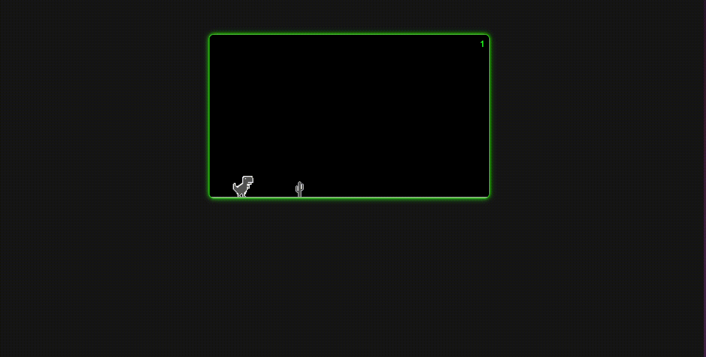

# Hack-a-Bit 2025: Debug Challenge 🐞🔧

**Hosted by GDG-DIT**  

---

## 📌 Overview
This repository contains buggy HTML/CSS/JS code. Your task is to debug the code to match the output shown in the **demo.mp4** video included in this repository. Do **not** rewrite the code entirely—fix the existing code to resolve issues.
[](./demo.gif)  
---

## 🚀 Instructions

### Step 1: Clone the Repository

git clone https://github.com/pratham7512/hack-a-bit.git

### Step 2: Review the Requirements
1. Watch **demo.mp4** in the repo to understand the expected output.
2. Read the **problem statement** in the original `README.md`.
3. Identify and debug issues in the provided HTML file to replicate the demo.

### Step 3: Debug the Code
- **Do NOT alter the code structure completely**. Only fix bugs.
- Keep all code (HTML, CSS, JS) in **a single HTML file**.
- Test your solution in a modern browser (Chrome/Firefox recommended).

### Step 4: Submit Your Solution
1. Rename your debugged file to `[teamid].html` (e.g., `team123.html`).
2. Upload it to **https://gdgdit.tech/round2/submission**.
3. Ensure your filename follows the format. **Incorrect names will be rejected!**

---

## 📋 Submission Guidelines
- **Deadline**: Submit before the round closes (check event timelines).
- **Tiebreaker**: If scores are tied, earlier submissions get priority.
- **Validation**: 
  - Your code must render exactly as shown in `demo.mp4`.
  - Do NOT use external CSS/JS files—embed everything in the HTML file.
  - Do NOT share your solution publicly; it may lead to disqualification.

---

## 🔍 Evaluation Criteria
1. **Accuracy**: Matches the `demo.mp4` output.
2. **Code Quality**: Clean, efficient fixes without unnecessary changes.
3. **Submission Time**: Earlier valid submissions win in case of ties.

---

## 🧠 Additional Notes
- **Test rigorously**: Check responsiveness, interactivity, and edge cases.
- **Use browser tools**: Leverage DevTools (F12) to inspect elements and debug.
- **Ask for help**: Reach out to organizers on Discord/Slack if stuck (but no code spoilers!).

---

## ❓ FAQ
**Q: Can I use frameworks like Bootstrap or React?**  
A: No. Use vanilla HTML/CSS/JS only.

**Q: What if I can’t access the demo video?**  
A: Contact organizers immediately. The video is critical for understanding requirements.

**Q: How do I confirm my submission was successful?**  
A: You’ll receive a confirmation email. If not, reupload or contact support.

---

**Happy Debugging! May the best debugger win!** 🏆  
*GDG-DIT Hack-a-Bit 2025 Organizers*
``` 
